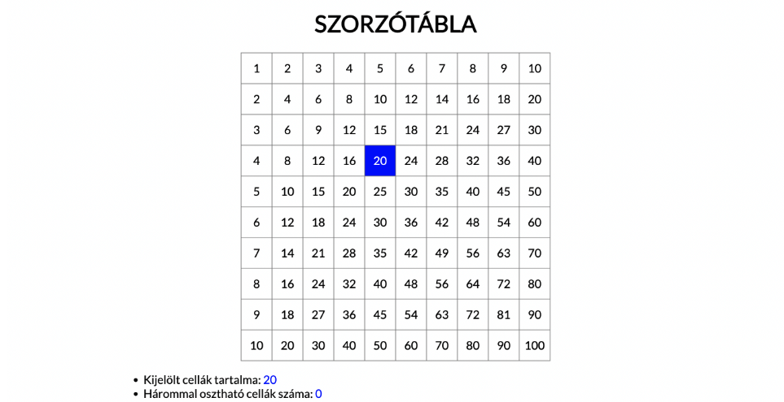
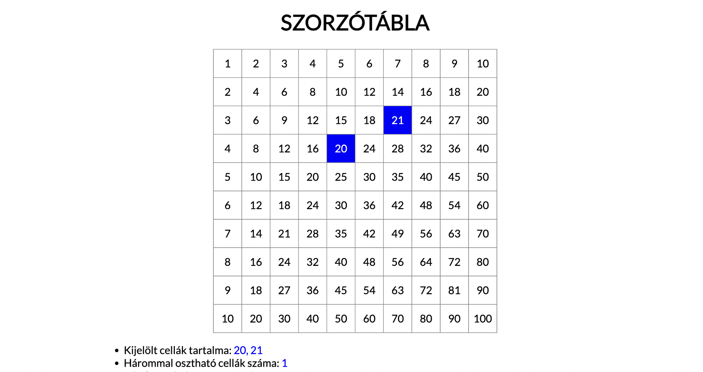

# Webprogramozás -- JavaScript csoportzh 
(15-ös csoport)

## Tudnivalók

1. A feladat beküldésével automatikusan elfogadod az alábbi nyilatkozatot:

    ```txt
    Kijelentem, hogy ez a megoldás a saját munkám. Nem másoltam vagy 
    használtam harmadik féltől származó megoldásokat. Nem továbbítottam 
    megoldást hallgatótársaimnak, és nem is tettem közzé. Az Eötvös Loránd 
    Tudományegyetem Hallgatói Követelményrendszere (ELTE szervezeti és 
    működési szabályzata, II. Kötet, 74/C. §) kimondja, hogy mindaddig, 
    amíg egy hallgató egy másik hallgató munkáját - vagy legalábbis annak 
    jelentős részét - saját munkájaként mutatja be, az fegyelmi vétségnek számít. 
    A fegyelmi vétség legsúlyosabb következménye a hallgató elbocsátása az egyetemről.
    ```

2. A megoldáshoz bármit használhatsz (internet, órai anyagok, házifeladat megoldások), de más személy és mesterséges intelligencia segítségét igénybe venni tilos!

3. [Innen töltheted le a kiindulási projektet!](feladatok.zip)

4. Nem fontos a feladatokat a megadott sorrendben elvégezned!

5. A feladatokra részpontokat is adunk.

6. A feladatok végeztével tömörítsd be a megoldásokat tartalmazó mappát (zip), és töltsd fel a Canvasre!

## Feladatok

1. Oldd meg a következő feladatokat tömbfüggényekkel és írd ki az eredményeket a konzolra! (3 pont)

   	- task1: Írd ki a `numbers` tömb 3-mal osztható számait! (0,5 pont)
	- task3: Írd ki, hogy a `matrix`ban hány negatív szám van! (0,5 pont)
	- task5: Írd ki a `movies` tömbből azt a filmet, amelyiknek a leghosszabb a címe! (1 pont)
	- task6: Írd ki a `movies` tömb legrégebbi filmjét. (1 pont)


2. Adott az oldalon két range slider, aminek segítségével egy képre a következő filtereket lehet alkalmazni: hue-rotate, grayscale. (2 pont)
    - A gombra kattintva olvasd be az inputok értékét! (1 pont)
    - A gombra kattintva állítsd be a kép filterét az inputok értékének megfelelően! pl. `filter: grayscale(50%)`)! *Tipp: egyszerre több filtert egymás után írva tudsz alkalmazni, pl. `filter: hue-rotate(90deg) grayscale(50%)`.* (1 pont)


3. Generáljunk egy szorzótáblát, melynek cellái-ra kattintva kiválasztjuk azokat, és megkapjuk a kiválasztott számokat felsorolva, mennyi osztható 3-mal és az összegüket. (5 pont)
    -	A Generálás feliratú gombra kattintva ez a gomb és a legördülő lista kerüljenek letiltásra! (1 pont) *Tipp: disabled HTML attribútumot kell beállítani.*
    -	Az előzővel egyidejűleg jelenjen meg az oldalon egy táblázat, amely egy szorzótáblát generál 1től a választott számig. (1 pont)
    -	Az egyes cellákra kattintva az adott cella kapja meg a `selected` stílusosztályt! (1 pont) *Tipp: A későbbi feladatok miatt célszerű lehet a kijelölt számot ezen a ponton egy tömbbe elmenteni.* *Tipp2: [classList](https://developer.mozilla.org/en-US/docs/Web/API/Element/classList)*
    -	Ha a kattintáskor a cella már selected osztályú, akkor távolítsd el róla a stílust!(0,5 pont)	*Tipp: Ha elmentetted a számot, akkor távolítsd el a tömbből is!.*
    -	A Kiválasztott számokat írd ki a task1 azonosítójú elembe vesszővel-szóközzel tagolva, emelkedő sorrendbe, ahogyan a mintán látható! (1 pont)
    -	Az előzővel egyidejűleg a task2 azonosítójú elembe írd ki a 3-mal osztható számok darabszámát. (0,5 pont)




